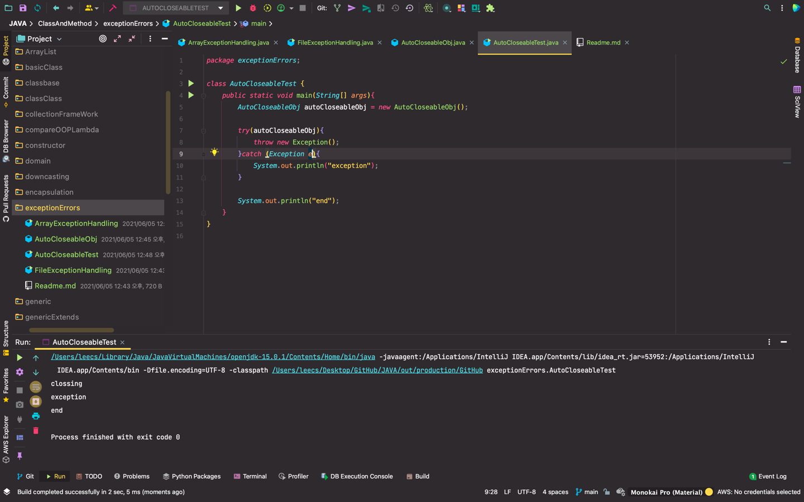

    try(FileInputStream fis = new FileInputStream("a.txt")){

    } catch(FileNotFoundException e){
        
    } catch(IOException e){
            
    }

- 이렇게 하면 Resource Close 를 자동으로 해주는 좋은 코딩
- 밑에 처럼 하는거 보다 훨씬 짧고 좋은 코딩

----------
    FileInputStream fis = null;

    try {
       fis = new FileInputStream("a.txt");
    } catch (FileNotFoundException e) {
        e.printStackTrace();
    } finally {
        if(fis != null) {
            try {
                fis.close();
            } catch (IOException e) {
                e.printStackTrace();
                //늘 불리는 경우는 finally로 해결하자
            }
        }
    }
----------

- but, 이런식으로도 사용할 수 있음 밖에서 선언하고 자동으로 close 되게!
- 사실 finally 안 쓰고도 이렇게 close 자동화로 할 수 있다는 코드

---------
- throws 는 사용하는 쪽에서 알아서 처리하세요 라는 의미
- catch 에서 Exception을 사용하고 싶으면 마지막 부분에 설정해서 사용할 것!
