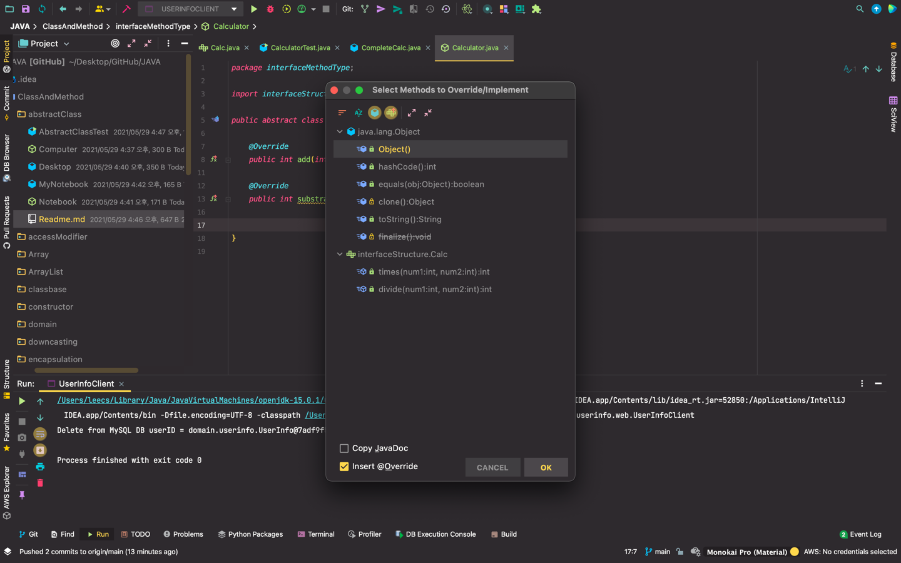

    default void description(){
        System.out.println("정수의 사칙연산을 제공합니다");
    }
    
    -> 재정의(overriding)가 가능한 method

    static int total(int[] arr){
        int total = 0;
        for(int num : arr){
            total += num;
        }
        return total;
    }
    
    -> instance 선언 없이도 사용가능해!

- 해당 경우를 보면 private의 경우 외부에서 사용이 불가능하다
