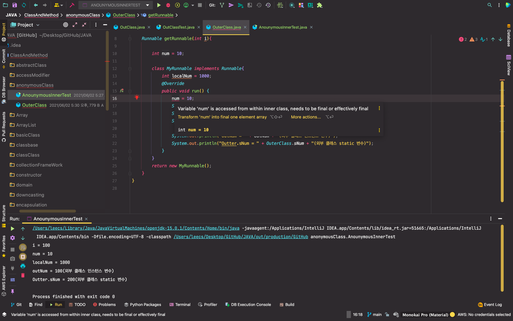
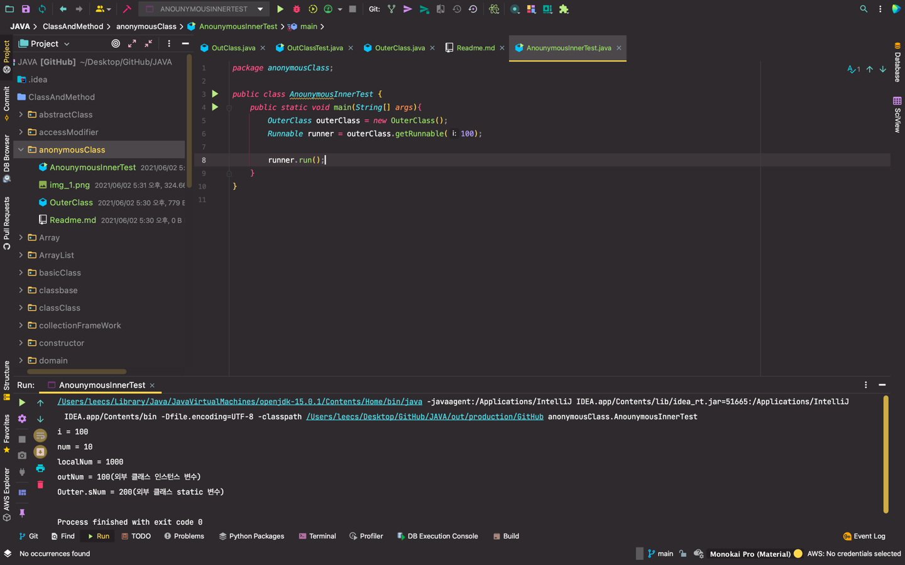

- 메소드 호출 이후에도 사용될 여지가 있는 경우 final로 자동 할당되어 stack 영역에 올라가는 것이 아닌 상수 영역에 할당된다!

- 메소드 호출 이후에도 사용된 경우

    Runnable getRunnable(int i){

        int num = 10;

        return new Runnable(){
            int localNum = 1000;
            @Override
            public void run() {

                System.out.println("i = " + i);
                System.out.println("num = " + num);
                System.out.println("localNum = " + localNum);

                System.out.println("outNum = " + outNum + "(외부 클래스 인스턴스 변수)");
                System.out.println("Outter.sNum = " + OuterClass.sNum + "(외부 클래스 static 변수)");
            }
        };
        // 바로 때려버리기 -> 이게 anonymous
    }
-> 이렇게 바로 넣는 방법도 존재 한다!

    Runnable getRunnable(int i){

        int num = 10;

        class MyRunnable implements Runnable{
            int localNum = 1000;
            @Override
            public void run() {

                System.out.println("i = " + i);
                System.out.println("num = " + num);
                System.out.println("localNum = " + localNum);

                System.out.println("outNum = " + outNum + "(외부 클래스 인스턴스 변수)");
                System.out.println("Outter.sNum = " + OuterClass.sNum + "(외부 클래스 static 변수)");
            }
        }
        return new MyRunnable();
    }

-> 비교 코드
